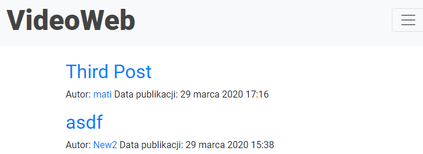

# Specyfikacja

Strona w django, łącząca się z bazą danych, pozwalająca użytkownikowi na stworzenie konta, dzięki któremu będzie mógł wstawiać filmy na stronę, nadawać im tytuł i opis. Użytkownik będzie mógł edytować opis i tytuły filmów oraz będzie mógł usuwać swoje filmy ze strony. Będzie także możliwość edytowania profilu użytkownika (zmiana zdjęcia profilowego, zmiana nicku, maila).  Inni użytkownicy będą mogli wstawiać komentarze pod filmem oraz wyświetlić listę wszystkich filmów zamieszczonych przez danego użytkownika.

Technologię użyte do projektu: Django, PostgreSQL, HTML, CSS, Bootstrap

# Raport I

Do tej pory utworzyłem baza danych projektu w PostgreSQL. Stworzyłem główną stronę serwisu, na której wyświetla się lista wszystkich filmów dodanych na stronie filmów (na razie można dodawać filmy tylko przez panel administracyjny). Każdy film ma swoją podstronę, na której jest więcej szczegółów.  
Do następnego raportu planuję dodać możliwość rejestracji, logowania, edytowania profilu, dodawania przez zalogowanego użytkownika filmów oraz ich usuwanie.  

Strona główna:  
  
Podstrona filmu:  
  

# Raport II

Dodałem możliwość rejestracji oraz logowania się użytkownika. Użytkownik może edytować swój profil (zmieniać zdjęcie profilowe, swoją nazwę, maila oraz hasło). Zalogowany użytkownik może dodawać filmy do strony oraz je usuwać (może usunąć tylko te filmy, które sam umieścił).  
Do następnego raportu planuję dodać użytkownikowi możliwość edytowania opisu pod filmem, możliwość zobaczenia jakie filmy dodał dany użytkownik, sekcje komentarzy dla zalogowanych użytkowników oraz w przypadku dużej ilości filmów na głównej stronie podzielenie jej na podstrony. Zamierzam też dodać bootstrapa do strony i wystylizować pasek nawigacji.  

Rejestracja:  
  
Logowanie:  
  
Profil:  
  
Zmiana hasła:  
  
Dodawanie filmu:  
  
Usuwanie filmu:  
  

# Raport III  

Dodałem użytkownikowi możliwość edytowania opisu pod filmem i jego nazwę, możliwość sprawdzenia jakie filmy dodał użytkownik, możliwość dodawania i czytania komentarzy pod filmami dla zalogowanych użytkowników oraz dodałem opcję, że przy dużej ilości filmów główna strona dzieli się na pod strony. Połączyłem bootstrapa ze stroną i wystylizowałem pasek nawigacyjny.  
Do następnego raportu planuję skończyć stylizowanie strony.  

Pasek nawigacji i podział na podstorny:  
  
Pasek nawigacji po zmniejszeniu strony:  
  
Rozwinięt pasek nawigacji po zmniejszeniu strony:  
  
Pod strona z filmami wybranego użytkownika:  
  
Edytowanie opisu i tytułu filmu:  
  
Dodawanie komentarzy:  
  

# Raport IV  

Skończyłem tworzyć wygląd całej strony. Zrobiłem kilka małych poprawek błędów odkryty w czasie testowania strony.
